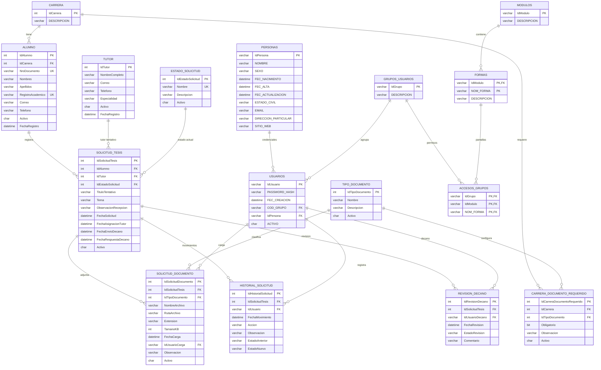

# DER - Gestion de Tesis

Este DER esta basado en las entidades y relaciones configuradas en `SistemaBase/Models/UAADbContext.cs`.

## Relaciones principales

| Tabla origen | Tabla destino | Relacion |
|---|---|---|
| `CARRERA` | `ALUMNO` | Una carrera tiene muchos alumnos |
| `CARRERA` | `CARRERA_DOCUMENTO_REQUERIDO` | Una carrera configura muchos documentos requeridos |
| `TIPO_DOCUMENTO` | `CARRERA_DOCUMENTO_REQUERIDO` | Un tipo de documento puede requerirse en muchas carreras |
| `ALUMNO` | `SOLICITUD_TESIS` | Un alumno puede registrar muchas solicitudes |
| `TUTOR` | `SOLICITUD_TESIS` | Un tutor puede estar asociado a muchas solicitudes |
| `ESTADO_SOLICITUD` | `SOLICITUD_TESIS` | Un estado puede estar asignado a muchas solicitudes |
| `SOLICITUD_TESIS` | `SOLICITUD_DOCUMENTO` | Una solicitud tiene muchos documentos cargados |
| `TIPO_DOCUMENTO` | `SOLICITUD_DOCUMENTO` | Un documento cargado corresponde a un tipo |
| `USUARIOS` | `SOLICITUD_DOCUMENTO` | Un usuario carga muchos documentos |
| `SOLICITUD_TESIS` | `HISTORIAL_SOLICITUD` | Una solicitud tiene muchos movimientos de historial |
| `USUARIOS` | `HISTORIAL_SOLICITUD` | Un usuario registra movimientos |
| `SOLICITUD_TESIS` | `REVISION_DECANO` | Una solicitud puede tener revisiones |
| `USUARIOS` | `REVISION_DECANO` | Un usuario decano registra revisiones |
| `PERSONAS` | `USUARIOS` | Una persona puede tener usuario |
| `GRUPOS_USUARIOS` | `USUARIOS` | Un grupo tiene muchos usuarios |
| `MODULOS` | `FORMAS` | Un modulo contiene muchas pantallas |
| `GRUPOS_USUARIOS` | `FORMAS` | Relacion muchos a muchos mediante `ACCESOS_GRUPOS` |

